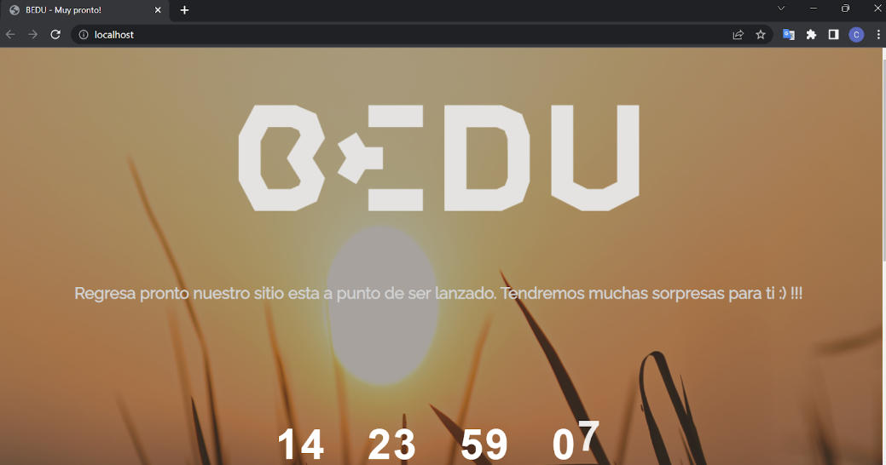

# Coming Soon BEDU 🚀

Página HTML sencilla para prueba de container docker Apache Server.

BEDU: Developer Engineering
* Sesión #4: Postwork
* Módulo #1: Desarrollo de software ágil
* Tema #4: Fundamentos de DevSecOps

## Evidencias 🗂️

Shell

BEDU Coming Soon

## Construido con 🛠️

* [Docker]() Servidor de contenedores
* [Visual Studio Code]() Editor utilizado

## Autor ✒️

* **Carlos Jaimez** - *Código inicial* - [carlosjz18](https://github.com/carlosjz18)